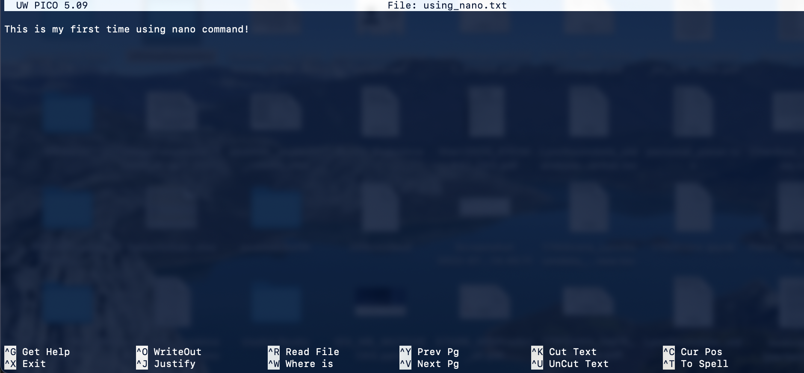

# BASH Tutorial

In this tutorial we will learn about the most common commands used in bash, how they work and what can we do with them.

## Command Change Directory (cd):
The command **Change Directory**, written *cd* in the command line or terminal, is a command that allows to go to a different directory inside of our system.
Basically, it allows to go from the folder we are in to a different folder in our system.

This command can be used in different ways, so we will go through all of them, explaining them and including some examples.

### 1. cd
When we write just the command cd in our terminal and press Enter, we are telling our computer to move from the directory we are at to our HOME directory.
When you open a terminal or console, the current working directory is set to your HOME directory by default. This command will take you to that folder.
It is written in the following way:

```console
SystemName:~ username$ cd
```

Now, let's imagine the structure in our HOME directory is the following: we have three folders (Folder1, Folder2 and Folder3) and inside of each one, there are 2 more folders.
- HOME directory
  * Folder1
    - Folder1_1
    - Folder1_2
  * Folder2
    - Folder2_1
    - Folder2_2
  * Folder3
    - Folder3_1
    - Folder3_2

### 2. cd PATH
In order to go to *Folder3_1* from our HOME directory we need to use *cd* in the following way and press Enter after that.

```console
System:~ username$ cd Folder3/Folder3_1
```
After executing the command we will see the following in our console, indicating the folder we are in:
```console
SystemName:~ username$ cd Folder3/Folder3_1
SystemName:Folder3_1$ 
```

### 3. cd ..
What if we want to go back to the parent folder of the one we are in? In our example, the parent folder of the *Folder3_1* is **Folder3**.
```console
SystemName:Folder3_1$ cd ..
```
After executing the command we will see the following in our console:
```console
SystemName:Folder3_1$ cd ..
SystemName:Folder3$ 
```
We can also concatenate the use of this command if we want. Let's go to Folder3_1 again.
```console
SystemName:~ username$ cd Folder3_1
SystemName:Folder3_1$ 
```
Now, imagine we want to go to the HOME Folder from here (Folder3_1).
Apart from doing it the way we already know, by typing *cd*, we can also do the following:
```console
SystemName:Folder3_1$ cd ../..
```
After executing the command we will see the following in our console, indicating we are back in our Working Directory:
```console
SystemName:Folder3_1$ cd ../..
SystemName:~ username$ 
```

## Command Print Working Directory (pwd):
We have spoken about the Working Directory in the previous section, but... How do I know its PATH? Fortunately we have the *pwd* command for that.
```console
SystemName:~ username$ pwd
```
After writing this command and pressing Enter, the **full path** of your Current Working Directory will be printed in the console.
```console
SystemName:~ username$ pwd
/Users/username/
```
If we are working in a different folder though, the *pwd* command will show the full path of the directory you are currently working at. So, let's go back to Folder3_1 so we can try it.
```console
SystemName:~ username$ cd Folder3/Folder3_1
SystemName:Folder3_1$ pwd
/Users/username/Folder3/Folder3_1
```
As you can see, now the print working directory command returns the full path of the folder we are currently in.
But, what if I want to know the full path of my HOME directory from any folder? We can do this by using the next command in our list: *echo*.

## Command to Print Strings or Lines in a console (echo):
The *echo* command is one of the most used in shell scripts and consoles in *Bash*. Its function is to print in the console a line or a string.
If you don't know what a string is, let's keep it simple. A string is a group of characters. ("Hello" is a string).

Let's go back to how to print the path of our HOME directory from any folder in our system. We are using *echo* command for that, with one of the default variables of your system: $HOME.
```console
SystemName:Folder3_1$ echo $HOME
/Users/username
```
We can also use *echo* command to print strings directly to our command line, like this:
```console
SystemName:Folder3_1$ echo 'Hello, world.'
Hello, world.
```
Of course! A tutorial about any programming language is not a good tutorial unless it has the print(**Hello, world.**) on it.

## Command Make Directory (mkdir):
You have learnt how to use three *Bash* commands so far, but let's learn yet another useful command, the command *mkdir*. This command is used to make directories (a fancy word for folders) in your current directory.
I want to create a new folder (Folder4) in my HOME directory. Can you help me with that?
Let's go back to our home directory first by using what we have already learnt so we can create our new folder there using the *mkdir* command.
```console
SystemName:Folder3_1$ cd
SystemName:~ username$ mkdir Folder4
```
Great! You've made it! Now, let's try to create the folders Folder4_1 and Folder4_2 inside of the new Folder4 you just created!
We can create more than one folder at the same time in the same directory in the following way with the *mkdir* command, but we need to go to our Folder4 first.
```console
SystemName:~ username$ cd Folder4
```
Once we are in Folder4, we can create Folder4_1 and Folder4_2 at the same time with the following syntax:
```console
SystemName:Folder4$ mkdir Folder4_1 Folder4_2
```
As you can see, we just need to provide the names of the folders we want to create separated by a Space in order to do it. Easy peasy!

## Command List Files (ls):
The command *ls* is used to explore the folders and files we have in the current directory. Its default use will return all the folders and files inside of the current directory, except for the **hidden files**. By now, we won't pay attention to what these hidden files are, but they are really important for our system to run correctly and all of their names start with a ".". So better let's not mess with them for now.

In order to explore our files and folders in the current directory we write *ls* and press Enter:
```console
SystemName:Folder4$ ls
Folder4_1 Folder4_2
```
As you can see, this command is giving you a list of the contents of your folder. Probably in your terminal your folders will be displayed in blue. The default colour of folders, files and executable files are blue, white (if your console is in dark mode) or black (if it is in light mode), and green respectively.

We can use the *ls* command with arguments to get more information about the files and folders in our current directory.
These are some of the most useful, depending on what you want:

* -a: Displays all files and directories, including hidden ones that start with a dot (.)
* -l: Displays the files and directories in a long format that includes additional information such as permissions, owner, group, size, and modification date
* -h: Makes the sizes of files and directories human-readable, showing them in units such as kilobytes (KB), megabytes (MB), and gigabytes (GB)
* -S: Sorts the files and directories by size, from largest to smallest
* -t: Sorts the files and directories by modification time, with the most recently modified files and directories displayed first
* -r: Reverses the order of sorting, displaying the files and directories in reverse order
* -R: Displays the files and directories recursively, including all subdirectories and their contents

We can write these arguments in two different ways.
Imagine we want *ls* to display the information in long format, with the sizes being human-readable and with the files sorted by modification time. We will use then the following arguments: -l, -h, -t.
```console
SystemName:Folder4$ ls -l -h -t
total 0
drwxr-xr-x  2 username  staff    64B May 10 12:30 Folder4_2
drwxr-xr-x  2 username  staff    64B May 10 12:30 Folder4_1
```
We can also write it like this:
```console
SystemName:Folder4$ ls -lht
total 0
drwxr-xr-x  2 username  staff    64B May 10 12:30 Folder4_2
drwxr-xr-x  2 username  staff    64B May 10 12:30 Folder4_1
```
As you can see, with both ways we get the same output.

## Command Copy (cp):
The command *cp* is used to copy files or directories from one location to another. Its syntax is really simple, you select the PATH of what you want to copy and you provide the PATH where you want to copy it.

Let's create first one empty text file (**.txt** is the file extension of text files) in our folder. We will go over the commands to create new files later, so write the following text in your console for now without thinking too much about it.
```console
SystemName:Folder4$ touch hello_world.txt
```
Now that we have our text file created, why don't we copy it inside Folder4_1?
As we are at the same directory our file -the one we want to copy- is, we only need to specify the file name first. After that, we will write the full PATH of the folder we want to copy it or the relative PATH to our current directory of the folder we want to copy it.

In this case, as Folder4_1 is in the same directory we are at, we can do simply this:
```console
SystemName:Folder4$ cp hello_world.txt Folder4_1
```
Let's copy the same file, but now we are going to copy it in the Folder2_1.
In this case, as Folder2_1 is not in the same directory we are at, we have to include the full PATH of the Folder2_1:
```console
SystemName:Folder4$ cp hello_world.txt /Users/username/Folder2/Folder2_1
```
Or we can also do it like this:
```console
SystemName:Folder4$ cp hello_world.txt ../Folder2/Folder2_1
```

## Commands to Create New Files (touch, >, >> and nano):
In order to create new files, we have different options. 
### 1. touch
We can create empty files easily by using the *touch* command. The syntax is the same we used to create our *hello_world.txt* in the previous section of the tutorial. You need to write "touch FILENAME.EXT", where FILENAME is the name you want for your file and .EXT is the extension of the file you want to create. You do not need to repeat this command as we already used it earlier.
```console
SystemName:Folder4$ touch hello_world.txt
```
### 2. > and >> commands
The **>** and **>>** commands are used to insert text on a file. We can insert text in a file like this, combining the *echo* command with the *>* command.
```console
SystemName:Folder4$ echo Hello, World! > hello_world.txt
```
The *>* command is used to write the text output of a command into a file. But remember, each time you use the *>* command, you rewrite the whole file.
Let's test this. If we check the contents of our file with a new command we will explain later, called *cat*, we will see the behaviour of this command.
```console
SystemName:Folder4$ cat hello_world.txt
Hello, World!
SystemName:Folder4$ echo Hello, Friend! > hello_world.txt
SystemName:Folder4$ cat hello_world.txt
Hello, Friend!
```
As you can see, the file contents were rewritten. If we want to avoid this behaviour when we want to append text at the end of a file, we can use the append command, *>>*.
The append command, *>>* appends a new line at the end of the file instead of rewritting its contents.
```console
SystemName:Folder4$ echo Hello, World! >> hello_world.txt
SystemName:Folder4$ cat hello_world.txt
Hello, Friend!
Hello, World!
```
But, what if we can write a file like we well do with a text editor? For that we have the command *nano*. This command will open a new file with the name you want and you can write the way you would with a text editor. Check the bottom of the window that pops up to learn how to close and save the changes in a file using nano.
```console
SystemName:Folder4$ nano using_nano.txt
```
Let's write and save our txt file. We want to write the following line inside of it: This is my first time using nano command!

It is pretty straight forward. You just need to press the sequence of keys to close the file and, if you made changes to it, the tool will ask you if you want to save the file. Press 'y' for yes or 'n' for no, and then press Enter. Try to write 'This is my first time using nano command!' using *nano*.

After having created and save the file, we can see the contents of the file and check if we did it correctly with one of the functions we will learn in the next part of the tutorial: *cat*.
```console
SystemName:Folder4$ cat using_nano.txt
This is my first time using nano command!
```
## Commands to Print Contents of Files (cat, head, tail):
There are a few functions to print the contents of the files and show them in the terminal as an output text. Depending on what we want to print we can use different functions.
### 1. cat
The function *cat* prints all the contents of a file in the terminal screen. When a text file is small, this is not a problem, but if we have a huge file, this is not convenient. As we checked in the previous section, we can print the contents of our *using_nano.txt* file with *cat* like this:
```console
SystemName:Folder4$ cat using_nano.txt
This is my first time using nano command!
```
### 2. head and tail
To check how the next functions (*head* and *tail*) work, we need to create a more complex text file. Do not worry, I will guide you step by step on how to do this. First we need to use the nano command to create a SHELL file called random_tsv.sh with the following contents (just copy this code inside of the nano screen and save the file):
```console
#!/bin/bash

# Define the number of rows to generate
num_rows=20

# Create the TSV file
echo "Column1\tColumn2\tColumn3" > output.tsv

# Generate the data for each row
for i in $(seq 1 $num_rows); do
  col1=$i
  col2=$(expr $i % 2)
  col3=$(expr $i % 4)
  echo "$col1\t$col2\t$col3" >> output.tsv
done

echo "File output.tsv generated successfully!"
```
Once we have this file created, we will run it in our computer with the following command. Once the run is finished we will see in the command line the folllowing line printed: "File output.tsv generated successfully!".
```console
SystemName:Folder4$ sh random_tsv.sh
File output.tsv generated successfully!
```
We can view the whole file by running the *cat* command and check its structure.
```console
SystemName:Folder4$ cat output.tsv
Column1	Column2	Column3
1	1	1
2	0	2
3	1	3
4	0	0
5	1	1
6	0	2
7	1	3
8	0	0
9	1	1
10	0	2
11	1	3
12	0	0
13	1	1
14	0	2
15	1	3
16	0	0
17	1	1
18	0	2
19	1	3
20	0	0
```
Let's see what the functions *head* and *tail* do. These functions will print by default the first (*head*) or last (*tail*) lines of a file. They can take one numeric argument to customize the number of lines we want them to print. This argument is written in the following syntax: a dash (-) followed by the number of lines we want the function to print.
The *head* function by default will return the following:
```console
SystemName:Folder4$ head output.tsv
Column1	Column2	Column3
1	1	1
2	0	2
3	1	3
4	0	0
5	1	1
6	0	2
7	1	3
8	0	0
9	1	1
```
If we add an argument to ask the function to print 5 lines, it will return the following:
```console
SystemName:Folder4$ head -5 output.tsv
Column1	Column2	Column3
1	1	1
2	0	2
3	1	3
4	0	0
```
The *tail* function works the same way. By default it will return the last 10 lines of the file, like here:
```console
SystemName:Folder4$ tail output.tsv
11	1	3
12	0	0
13	1	1
14	0	2
15	1	3
16	0	0
17	1	1
18	0	2
19	1	3
20	0	0
```
If we add an argument to ask the function to print the last 5 lines, it will return the following:
```console
SystemName:Folder4$ tail -5 output.tsv
16	0	0
17	1	1
18	0	2
19	1	3
20	0	0
```
## Command to Search and Print Patterns in Files (grep):
The *grep* command is used to retrieve the information following a specific pattern or that includes a specific pattern in files.
Imagine I am only interested in the line that contains the information of the number 15 in our *output.tsv* file. If I only want to print the information for that specific line, we can use grep to extract it.
```console
SystemName:Folder4$ grep 15 output.tsv
15	1	3
```
So by using this function we can search a file for the lines that contains a specific string.
This function can be used to search for complex string patterns as it allows to use regular expressions (regexes) as a pattern, but this is out of the scope of this tutorial. However, we will include one example of this for our *output.tsv* file. Imagine that we want to extract all the columns that contain the information of the numbers, without the header with the name of the columns. We can do it by using the following code with the *grep* function:
```console
SystemName:Folder4$ grep -E '^[0-9]+\t[0-9]+\t[0-9]+$' output.tsv
1	1	1
2	0	2
3	1	3
4	0	0
5	1	1
6	0	2
7	1	3
8	0	0
9	1	1
10	0	2
11	1	3
12	0	0
13	1	1
14	0	2
15	1	3
16	0	0
17	1	1
18	0	2
19	1	3
20	0	0
```
As you can notice, now we have the same file but without the line containing the headers.
The expression **'^[0-9]+\t[0-9]+\t[0-9]+$'** is a regular expression (regex).
If you want to learn more about regular expressions you can do it through this link: [Regex](https://www.gnu.org/software/grep/manual/grep.html#Regular-Expressions).
